# Tutorial Jasper Report

## Apa itu Jasper Report?

>**JasperReports** adalah sebuah library open-source yang digunakan untuk membuat laporan dalam aplikasi Java. Dengan menggunakan JasperReports, Anda dapat membuat laporan yang terdiri dari tabel, grafik, gambar, dan elemen-elemen lainnya. Library ini memiliki fitur yang kuat untuk mengatur tata letak, pemformatan, dan penggabungan data. JasperReports juga mendukung berbagai format output laporan seperti PDF, Excel, HTML, dan lain-lain.
 
## Keuntungan menggunakan JasperReport?
1. **Kemudahan penggunaan**: JasperReport menyediakan tampilan desain visual yang intuitif untuk membangun laporan. Anda dapat mengatur tata letak, gaya, dan elemen-elemen lainnya dengan mudah menggunakan alat desain yang disediakan.

2. **Format laporan yang fleksibel**: JasperReport memungkinkan Anda menghasilkan laporan dalam berbagai format, termasuk PDF, Excel, HTML, dan CSV. Anda dapat dengan mudah mengubah format laporan tanpa perlu mengubah kode aplikasi Anda.

3. **Integrasi yang baik**: JasperReport dapat diintegrasikan dengan berbagai platform dan teknologi lainnya, seperti Java, Spring, Hibernate, dan banyak lagi. Ini memudahkan penggunaan dan pengembangan laporan di lingkungan yang sudah ada.

## Requirement
1. Project SpringBoot dengan menambahkan Dependency dibawah ini.
```xml
<dependency>
   <groupId>net.sf.jasperreports</groupId>
   <artifactId>jasperreports</artifactId>
   <version>6.20.6</version>
</dependency>

<dependency>
    <groupId>org.bouncycastle</groupId>
    <artifactId>bcprov-jdk15on</artifactId>
    <version>1.68</version>
</dependency>
```
2. JasperSoft Studio, untuk melakukan pembuatan report: [Link](https://sourceforge.net/projects/jasperstudio/) 

## Step Penggunaan Jasper Report

### Tutorial Jasper Report

> pada tutorial ini akan memberikan contoh penggunaan jasper report yang mana data didapatkan dari parameter, ada alternatif lain yaitu dengan koneksi dengan database lain, hal tersebut dapat di cari sendiri, karena contohnya cukup banyak di internet
> dan hanya memberikan contoh export ke PDF dan HTML

1. buka JasperSoft Studio
2. create project dan buat file jasper report
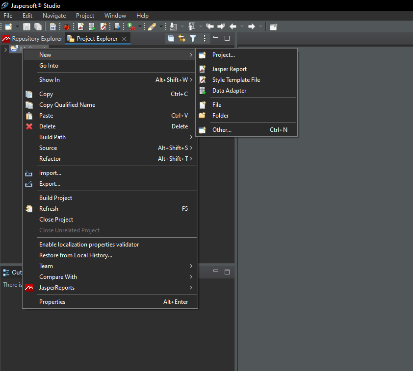
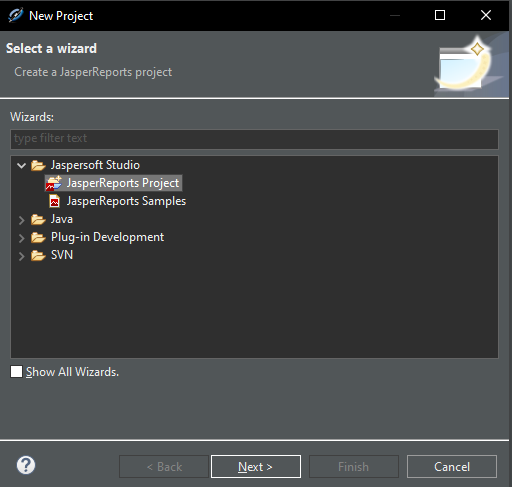
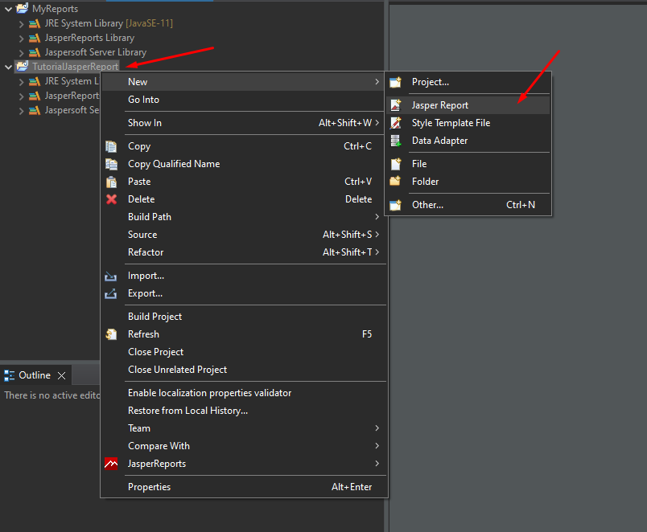
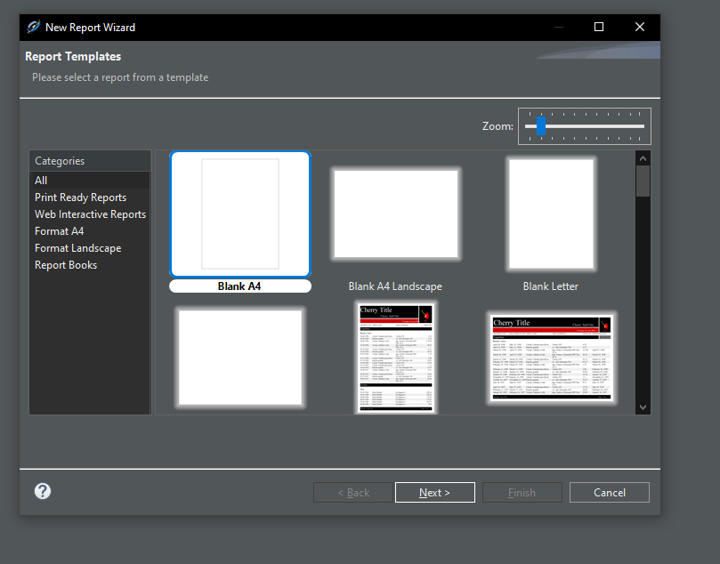

3. membuat report
Gambar dibawah merupakan playground teman-teman saat membuat report:
- di sebelah kanan adalah komponen static yang dapat di drag n drop yang digunakan pada file report
- sebelah kiri adalah parameter yang nantinya akan kita gunakan dan di isi secara dynamic dari code
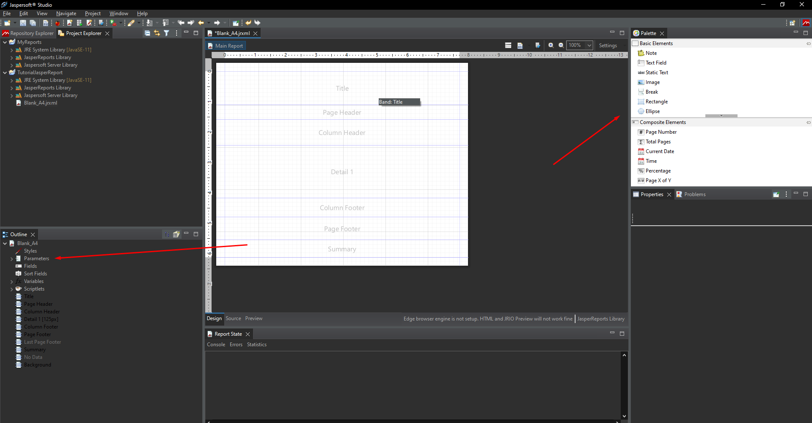
setelah komponen sudah dilakukan drag n drop ke arah report, propertiesnya dapat diubah-ubah di section yang di tunjukkan di gambar bawah ini
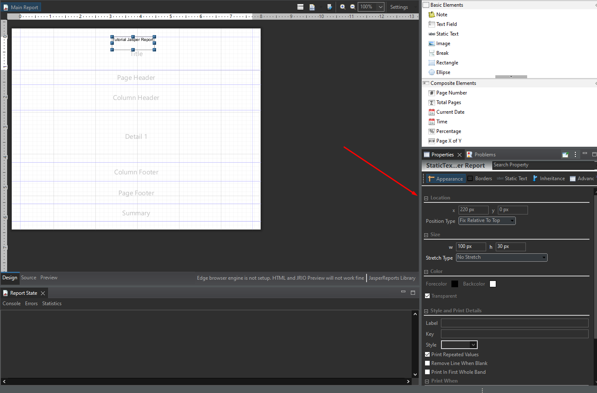
untuk membuat parameter bisa klik kanan pada "parameter" dan create parameter
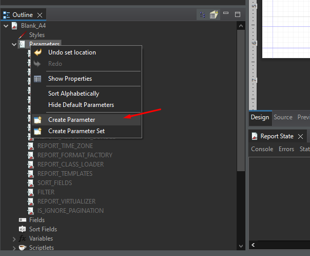

gambar dibawah:
kiri merupakan parameter yang sudah dibuat, dan setelah di kanan parameter tersebut dapat di rename dan di ubah tipe datanya sesuai tipe data yang di inginkan
(saran gunakanlah String, karena secara universal dapat di custom sesuai keinginan di code)
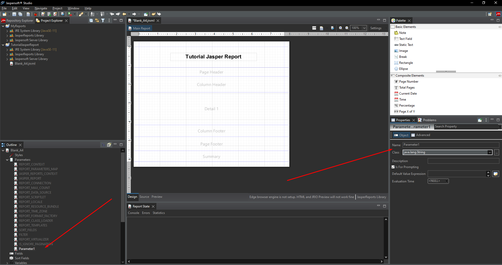
berikut contoh report yang sudah dibuat
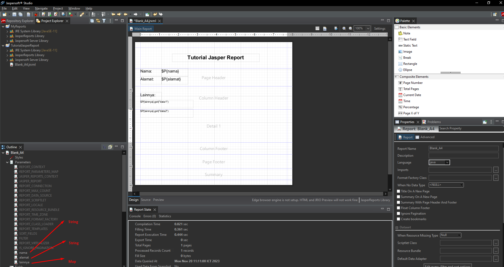
setelah membuat report, compile file .jrxml menjadi .jasper kemudian file .jasper copy kedalam projek spring boot

**PENTING:**
Pastikan save terlebih dahulu sebelum di compile.
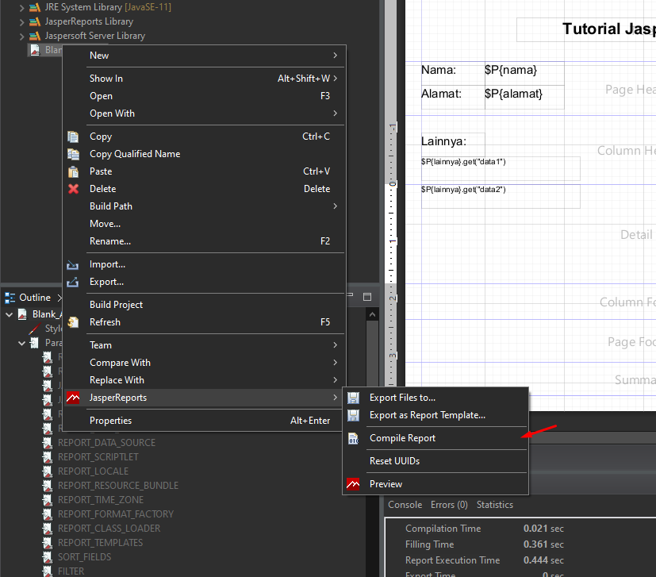
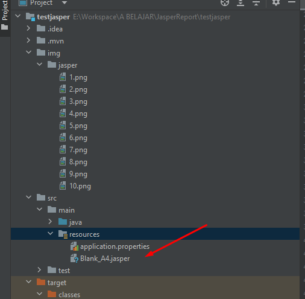

> penggunaan jasper report pada spring boot bisa lihat dari code.

contoh report yang setelah di generate
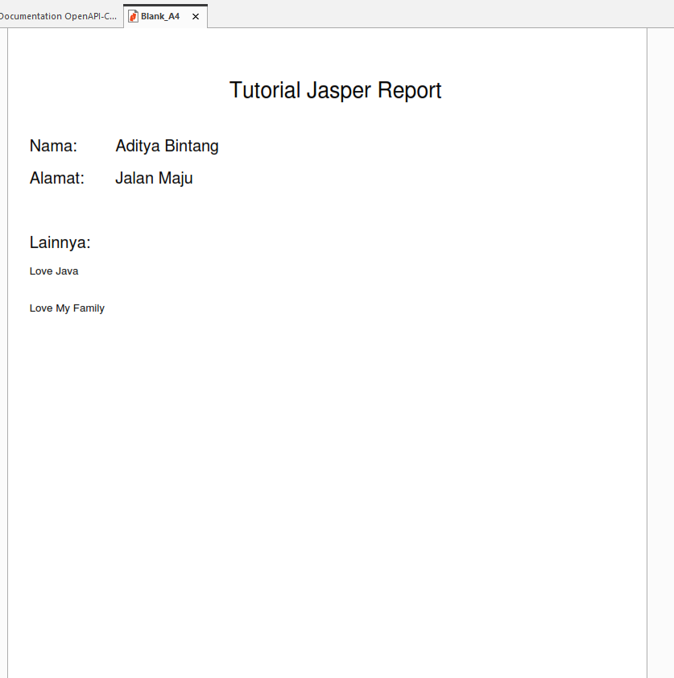
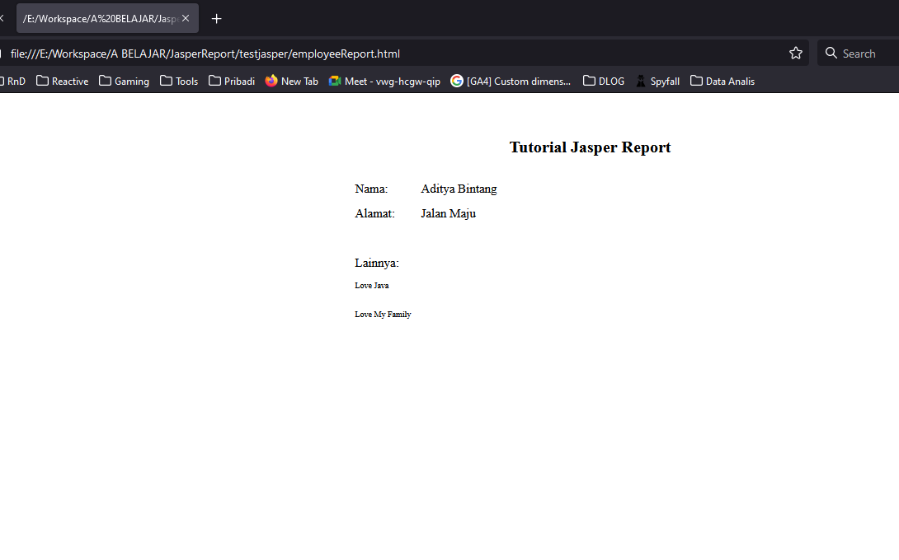